# Yesoul_BLE

Bridge a **Yesoul indoor spin bike** to:

- **Garmin watches and Edges** (`epix 2`, `Fenix 7`/`8`, etc.) — power, cadence, speed, distance into a Bike Indoor activity natively.
- **Zwift / TrainerRoad / Wahoo SYSTM / MyWhoosh / Rouvy** — full smart-trainer payload (power, cadence, speed, distance, **resistance**, energy, elapsed time) over FTMS.

No Connect IQ apps, no third-party companions, no cloud.

## Origins

This is a heavily-extended fork of [**Raelx/Yesoul_BLE**](https://github.com/Raelx/Yesoul_BLE) by **Raelx** and **Jeremy Mikesell**, who built the original single-ESP CPS-only bridge. Their work — including the empirical 1.28 power-scale calibration constant, the FTMS-Indoor-Bike-Data-to-CPS translation pattern, and the NimBLE setup — is the foundation everything here is built on. This fork retains their power calibration, NimBLE callback structure, and ethos; everything else is rewritten against NimBLE 2.x with several years of empirical testing baked in.

The first commits in this repo's history are theirs (`414aad8 Scaling for Power`, `04a3975 Working power and cadence`, etc.). If this fork is useful to you, please ★ the [upstream repo](https://github.com/Raelx/Yesoul_BLE) too.

## What this fork adds

- **Speed and distance** delivered to Garmin watches via a separate Cycling Speed and Cadence Service (CSC) on a second ESP — required because the Yesoul allows only one BLE central, and Garmin Fenix-class firmware filters out devices exposing CPS+CSC together.
- **Smart-trainer support** for Zwift / TrainerRoad / etc. via Fitness Machine Service (FTMS) on a third ESP (or the same chip in standalone mode).
- **ESP-NOW relay** between ESPs so the bike's one-central limit doesn't matter — the master ESP broadcasts parsed bike frames to siblings.
- **Spec-driven FTMS parser** with a host-side replay test against captured ground-truth frames.
- **Complete rewrite** against NimBLE-Arduino 2.x with explicit state machine, watchdog, scan backoff, and clean reconnect handling.
- **Multiple deployment topologies** (below) — pick whichever matches what you have and what you ride with.

## Deployment options

```mermaid
flowchart TB
    subgraph A["Option A — Single C6 (Zwift + Garmin watch power/cadence)"]
        bikeA["Yesoul"] -->|FTMS BLE| c6A["1× ESP32-C6<br/>Yesoul_FTMS"]
        c6A -->|"FTMS BLE<br/>full smart trainer"| zwiftA["Zwift / TR / etc."]
        c6A -->|"CPS BLE<br/>power + cadence"| watchA["Garmin watch"]
    end
    subgraph B["Option B — Watch-only with speed/distance (no Zwift)"]
        bikeB["Yesoul"] -->|FTMS BLE| pwrB["WROOM-32 Yesoul_PWR"]
        pwrB -->|CPS| watchB["Garmin watch"]
        pwrB -.ESP-NOW.-> spdB["WROOM-32 Yesoul_SPD"]
        spdB -->|CSC| watchB
    end
    subgraph C["Option C — Watch with speed/distance + Zwift simultaneously"]
        bikeC["Yesoul"] -->|FTMS BLE| pwrC["WROOM-32 Yesoul_PWR"]
        pwrC -->|CPS| watchC["Garmin watch"]
        pwrC -.ESP-NOW.-> spdC["WROOM-32 Yesoul_SPD"]
        pwrC -.ESP-NOW.-> trnC["ESP32-C6 Yesoul_FTMS"]
        spdC -->|CSC| watchC
        trnC -->|FTMS| zwiftC["Zwift / TR"]
    end
```



| Option | Hardware | Watch metrics | Zwift | Build env |
|---|---|---|---|---|
| **A — Single C6** *(recommended for most users)* | 1× **ESP32-C6** (Seeed XIAO recommended) | power + cadence | full smart trainer | `pio run -e trainer_c6` |
| **B — Watch-only with speed/distance** | 2× **ESP32-WROOM-32** | power + cadence + speed + distance | — | `pio run -e power` + `pio run -e speed` |
| **C — Speed/distance on watch + Zwift** | 2× WROOM-32 + 1× C6 (or 3× WROOM-32) | power + cadence + speed + distance | full smart trainer | `pio run -e power` + `pio run -e speed` + (`trainer_c6` or `trainer`) |

**Most users want Option A.** It's a single-board solution that gives a Garmin watch power and cadence (the metrics that actually matter for training) and Zwift a full smart-trainer payload — power, cadence, speed, distance, resistance, energy, elapsed time. The trade-off vs. Option B/C is that the watch doesn't get speed/distance recorded natively (Garmin Fenix-class firmware caps at one BLE connection per physical peripheral, and CPS+CSC on the same chip trips a separate dedup filter — see [`docs/JOURNEY.md`](docs/JOURNEY.md)).

Indoor speed/distance on the watch is mostly cosmetic (it's just `cadence × wheel-circumference × time` with no environmental data) so most cyclists pick Option A and call it done. Riders who specifically want the watch's activity record to include those fields go to Option B or C.

In Options B and C the bike's one-BLE-central limit is bypassed by ESP-NOW — the WROOM-32 with the `power` role connects to the bike and broadcasts each parsed frame over its 2.4 GHz radio; the speed and trainer ESPs receive the relay rather than scanning the bike themselves.

## Hardware

| Component | Notes |
|---|---|
| **ESP32-C6** (preferred for trainer / standalone roles) | Seeed XIAO ESP32-C6 (~AU$11). BLE 5.3, on-board PCB antenna, USB-C, single-board solution for Zwift use case. Requires the [pioarduino](https://github.com/pioarduino/platform-espressif32) PlatformIO platform fork (handled in `[env:trainer_c6]`). |
| **ESP32-WROOM-32** (any classic ESP32) | The original CH340 dev boards. ~AU$10 each. Works for `power` / `speed` / `trainer` roles but not the `single-esp-experiment` branch (chip's BLE 4.2 doesn't support extended advertising — see [`docs/SINGLE_ESP_ATTEMPT.md`](docs/SINGLE_ESP_ATTEMPT.md) for that dead end). |
| **Yesoul indoor bike** | Tested with the **G1M Plus**. The upstream tested with the **S3**. Other Yesoul models likely work; non-Yesoul FTMS bikes very likely work but are untested. |
| **Garmin Fenix 7 / epix 2 / Edge** | Verified on epix 2. Older Garmins or Edges may consume CPS+CSC on a single device — see [`docs/JOURNEY.md`](docs/JOURNEY.md). |
| **Phone / tablet / PC running Zwift** | Any modern Zwift-capable device. Tested on iPhone. |

## Build & flash

PlatformIO via a Python venv (the project predates Python 3.14 compatibility in PlatformIO and macOS Homebrew; the venv keeps things sane on any host):

```bash
python3.13 -m venv .venv
.venv/bin/pip install platformio intelhex
```

Identify connected ESPs:

```bash
.venv/bin/pio device list | grep -E 'usbserial|usbmodem'
# WROOM-32 boards: /dev/cu.usbserial-XXX (CH340)
# XIAO ESP32-C6:    /dev/cu.usbmodemXXX  (native USB-Serial/JTAG)
```

Flash by role:

```bash
# Option A — standalone Zwift on C6
.venv/bin/pio run -e trainer_c6 -t upload --upload-port /dev/cu.usbmodemXXX

# Option B — watch only (two WROOM-32s)
.venv/bin/pio run -e power -t upload --upload-port /dev/cu.usbserial-AAA
.venv/bin/pio run -e speed -t upload --upload-port /dev/cu.usbserial-BBB

# Option C — add a third (C6 or WROOM-32) for Zwift
.venv/bin/pio run -e trainer_c6 -t upload --upload-port /dev/cu.usbmodemCCC
# or, on a WROOM-32:
.venv/bin/pio run -e trainer    -t upload --upload-port /dev/cu.usbserial-CCC
```

Watch live serial output:

```bash
.venv/bin/pio device monitor --port /dev/cu.usbserial-XXX
```

## Pair on the watch

### Option A (single C6)

1. Settings → Sensors & Accessories → Add Sensor → **Power** → search → pair `Yesoul_FTMS`.
2. Start a Bike Indoor activity and ride. Power and cadence flow.

(Speed / distance won't be available — they live on the FTMS service which Zwift consumes, but Garmin watches don't read FTMS as a sensor.)

### Options B and C (dual-WROOM-32 with separate Power and Speed sensors)

1. Settings → Sensors & Accessories → Add Sensor → **Power** → search → pair `Yesoul_PWR`.
2. Add Sensor → **Speed** → search → pair `Yesoul_SPD`. Set **Wheel Size** to **2000 mm** in that sensor's details (matches the firmware's `WHEEL_CIRCUMFERENCE_M`).
3. Start a Bike Indoor activity and ride. All four metrics flow.

In Option C the C6's `Yesoul_FTMS` will also appear under "Add Sensor → Power" (it advertises CPS too). Don't pair it on the watch — the dedicated `Yesoul_PWR` is the one with the Garmin-watch story; pair `Yesoul_FTMS` only with Zwift.

## Pair in Zwift / TrainerRoad / similar (Options A and C)

1. Open the app's Devices / Pair Sensors screen.
2. Search for a smart trainer / FTMS device → `Yesoul_FTMS` should appear under FTMS / Controllable.
3. Pair as a smart trainer. Power, cadence, speed, distance, resistance, energy, and elapsed time all flow.
4. **Manual resistance**: the Yesoul has a physical knob, so the firmware ACKs Zwift's gradient / target-power / Set Indoor Bike Simulation commands (Zwift's documented start sequence) but can't physically change the bike's resistance. Turn the knob yourself to feel hills or hit ERG targets. The visual / power-tracking / activity recording all work; you just drive resistance manually.

## Tests

The FTMS parser has a host-side replay test against a captured 45-frame log:

```bash
c++ -std=gnu++17 -I src src/ftms_parser.cpp test/test_parser/test_main.cpp -o /tmp/test_parser
/tmp/test_parser
```

Expected: `frames=45 legacy_match=45 ... PASS`.

## Tunables

In [`src/main.cpp`](src/main.cpp):

- `POWER_SCALE` (default `1.00f`). The upstream Raelx project shipped `1.28f` based on a calibration whose methodology was never documented in the repo. This fork ships `1.0` so apps see exactly what the bike's own display shows. If you have a reference power meter and the bike under-reports against it, divide your reference by the bike's reported watts and set this to that ratio. One-line change, re-flash.
- `WHEEL_CIRCUMFERENCE_M` (default `2.000f`). Used to synthesize wheel revolutions from bike-reported speed. The watch must use the same value (2000 mm) in its speed sensor settings.
- `SIMULATE_BIKE` (default `false`). Flip to `true` to bench-test pairing without actually pedaling — the firmware injects constant fake values (20 km/h, 60 RPM, 150 W) and skips the bike-side BLE scan. Useful for diagnosing app-side connection issues.

## Documentation

- [`docs/ARCHITECTURE.md`](docs/ARCHITECTURE.md) — system topology, components, every role's GATT structure, what each ESP does, what was deliberately not shipped.
- [`docs/PROTOCOL.md`](docs/PROTOCOL.md) — FTMS Indoor Bike Data byte layout, parser, capture format, CPS / CSC / FTMS re-emission specifics.
- [`docs/JOURNEY.md`](docs/JOURNEY.md) — the empirical trail of every dead end and decision. Includes the Garmin watch single-peripheral limit finding, the FTMS pass-through investigation, the BLE-5.0-on-ESP32-classic dead end, the standalone-C6 success, and citations for every claim.
- [`docs/SINGLE_ESP_ATTEMPT.md`](docs/SINGLE_ESP_ATTEMPT.md) — the single-ESP-via-multi-advertising experiment that worked on iPhone but is fundamentally blocked on Garmin watches.
- [`docs/captures/`](docs/captures/) — ground-truth FTMS captures from the bike, used as parser test fixtures.

## Branches

| Branch | Status |
|---|---|
| [`master`](https://github.com/Topherr/Yesoul_BLE/tree/master) | Production. All three deployment options live here. |
| [`feature/ftms-trainer`](https://github.com/Topherr/Yesoul_BLE/tree/feature/ftms-trainer) | Where the Zwift-trainer support landed. Merged into master. |
| [`single-esp-experiment`](https://github.com/Topherr/Yesoul_BLE/tree/single-esp-experiment) | Documented dead end — single ESP serving as both Power and Speed sensor for a Garmin watch via BLE 5.0 multi-advertising. Works on iPhone, blocked by Garmin firmware. |

## Known limitations

- **Single-bike, single-user.** The bike-side scan matches FTMS service UUID `0x1826` alone — if there's another FTMS device in range, behavior is undefined. Add a name-prefix or MAC filter in `ScanCallbacks::onResult` if needed.
- **No electronic resistance control.** The Yesoul has a manual knob. Zwift's "smart trainer" commands are ACKed but can't be physically applied. A servo-on-knob upgrade would close the loop and is conceptually doable (~$15 hardware, ~30 LOC).
- **POWER_SCALE is uncalibrated for *your* bike.** The upstream's 1.28 was empirically derived for a Yesoul S3; this fork ships 1.0 (raw watts) by default. Calibrate against a reference power meter if accuracy matters for training.
- **Garmin Fenix 7 / epix 2 / Forerunner family caps at one BLE connection per physical peripheral.** This is the reason for the dual-WROOM-32 architecture in Option B / C; see `docs/JOURNEY.md` for the full evidence trail. Newer Garmins (Fenix 8+) may not have this limit — untested.

## Acknowledgements

- [**Raelx**](https://github.com/Raelx) and **Jeremy Mikesell** — original [Yesoul_BLE](https://github.com/Raelx/Yesoul_BLE), upstream of this fork. The CPS bridge pattern, NimBLE callback layout, and the 1.28 power-scale constant are theirs.
- [**Imran Haque (PeloMon)**](https://ihaque.org/posts/2021/01/04/pelomon-part-iv-software/) — independently documented the Garmin-watch single-peripheral-connection limit on Fenix 5 in 2021. Saved this fork hours of "is it our code or theirs?" debugging.
- [**h2zero (NimBLE-Arduino)**](https://github.com/h2zero/NimBLE-Arduino) — the BLE library this fork builds on. NimBLE 2.x is dramatically nicer than the older nkolban-ESP32-BLE-Arduino.
- [**pioarduino**](https://github.com/pioarduino/platform-espressif32) — fork of PlatformIO's espressif32 that ships a recent enough Arduino-ESP32 to compile for ESP32-C6. Required for Option A.
- [**teaandtechtime — Arduino BLE Cycling Power Service**](https://teaandtechtime.com/arduino-ble-cycling-power-service) — the explainer post the upstream cited that made the CPS frame layout legible.
