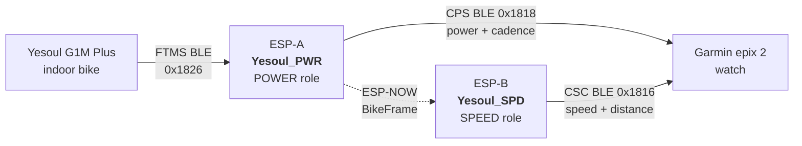

# Yesoul_BLE

Bridge a **Yesoul G1M Plus** indoor spin bike to a **Garmin epix 2 watch** (and probably any modern Fenix-class watch). Power, cadence, speed, and distance flow into a Bike Indoor activity natively — no Connect IQ apps or third-party companions.

Fork of [Raelx/Yesoul_BLE](https://github.com/Raelx/Yesoul_BLE) by Raelx and Jeremy Mikesell — single-ESP CPS-only bridge. The 1.28 power-scale constant is inherited from their empirical calibration; the rest of this fork is rewritten against NimBLE 2.x.

## Architecture



- **POWER ESP** owns the BLE connection to the bike, parses FTMS, publishes Cycling Power Service (power + cadence) to the watch, and broadcasts each parsed frame over ESP-NOW.
- **SPEED ESP** receives over ESP-NOW (the bike allows only one BLE central, so the SPEED ESP doesn't talk to it directly), publishes Cycling Speed and Cadence Service (wheel-rev → speed/distance) to the watch.

Why two devices: Garmin epix 2 firmware (2026) refuses to enumerate a single BLE peripheral that exposes both CPS and CSC under "Add Sensor → Speed". One sensor category per device is the only working topology with current Fenix 7 / epix 2 firmware. Full evidence trail in [docs/JOURNEY.md](docs/JOURNEY.md).

> A single ESP could probably do this with BLE 5.0 multi-advertising — I had two in a drawer and didn't try. See [docs/JOURNEY.md#what-i-didnt-try](docs/JOURNEY.md#what-i-didnt-try).

## Hardware

| Component | Notes |
|-----------|-------|
| 2× ESP32-WROOM-32 dev boards (CH340 USB-UART) | Any ESP32 should work; ESP-S3/C3 may need board target adjustment in `platformio.ini`. |
| Yesoul G1M Plus indoor bike | Other FTMS bikes likely work but untested. |
| Garmin epix 2 watch | Verified target. Other Fenix 7-class watches probably fine. Older Garmins or Edges may consume CPS+CSC on a single device — see [docs/JOURNEY.md](docs/JOURNEY.md). |

## Build & flash

PlatformIO via a Python venv (Brew's PlatformIO segfaulted on Python 3.14 at the time of writing):

```bash
python3.13 -m venv .venv
.venv/bin/pip install platformio intelhex
```

Identify each ESP's serial port:

```bash
.venv/bin/pio device list | grep usbserial
```

Flash one as POWER, the other as SPEED:

```bash
.venv/bin/pio run -e power -t upload --upload-port /dev/cu.usbserial-XXX
.venv/bin/pio run -e speed -t upload --upload-port /dev/cu.usbserial-YYY
```

Watch serial output:

```bash
.venv/bin/pio device monitor --port /dev/cu.usbserial-XXX
```

## Pair on the watch

1. Settings → Sensors & Accessories → Add Sensor → **Power** → search → pair `Yesoul_PWR`.
2. Add Sensor → **Speed** → search → pair `Yesoul_SPD`. Set **Wheel Size** to **2000 mm** in that sensor's details (matches `WHEEL_CIRCUMFERENCE_M` in firmware).
3. Start a Bike Indoor activity and ride.

## Tests

The FTMS parser has a host-side replay test against a captured 45-frame log:

```bash
c++ -std=gnu++17 -I src src/ftms_parser.cpp test/test_parser/test_main.cpp -o /tmp/test_parser
/tmp/test_parser
```

Expected: `frames=45 legacy_match=45 ... PASS`.

## Tunables

In [`src/main.cpp`](src/main.cpp):

- `POWER_SCALE` (default `1.28f`) — empirical correction; the Yesoul under-reports relative to a calibrated power meter. Inherited from the upstream project. Recalibrate by riding at known watts on a reference meter and dividing reference / raw.
- `WHEEL_CIRCUMFERENCE_M` (default `2.000f`) — wheel size used to synthesize wheel revolutions from speed. The watch must be configured with the same value (2000 mm) in the speed sensor's details.
- `SIMULATE_BIKE` (default `false`) — flip to `true` to bench-test pairing without pedaling. The POWER ESP injects constant fake values (20 km/h, 60 RPM, 150 W) instead of connecting to the bike.

## Docs

- [docs/ARCHITECTURE.md](docs/ARCHITECTURE.md) — system topology, components, pairing flow, what's deliberately not shipped.
- [docs/PROTOCOL.md](docs/PROTOCOL.md) — FTMS frame layout, parser, captures format, CPS / CSC re-emission.
- [docs/JOURNEY.md](docs/JOURNEY.md) — every dead end and why we ended up at dual-ESP + ESP-NOW. Useful for fork maintainers.
- [docs/captures/](docs/captures/) — ground-truth FTMS captures used as parser test fixtures.

## Known limitations

- Single-bike, single-user device. The bike-side scan matches on FTMS service UUID `0x1826` alone — if there's another FTMS bike in range, it might connect to the wrong one. Add a name-prefix or MAC filter if needed.
- Two ESPs is more hardware than ideal. See the "single-ESP" note above.
- Resistance is parsed from the bike but not delivered to the watch — Garmin doesn't consume resistance from any standard BLE service.
