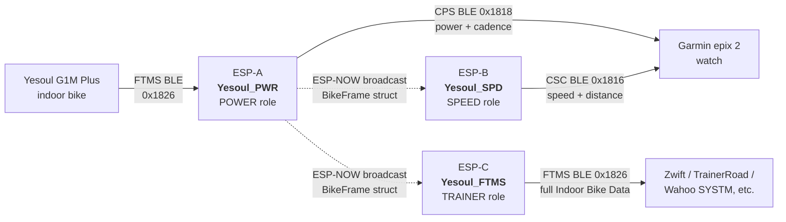

# Architecture

## Topology



Three ESP32-WROOM-32 dev boards. Same firmware. Role selected at compile time via `-DDEVICE_ROLE_POWER` / `-DDEVICE_ROLE_SPEED` / `-DDEVICE_ROLE_TRAINER` in [`platformio.ini`](../platformio.ini).

- **POWER ESP** — only one talking to the bike. Subscribes to FTMS Indoor Bike Data 0x2AD2, parses, publishes Cycling Power Service notifications to the watch (power + cadence), and broadcasts each parsed frame over ESP-NOW.
- **SPEED ESP** — does *not* talk to the bike (the Yesoul allows only one BLE central). Receives `BikeFrame` structs over ESP-NOW, derives wheel revolutions from speed, publishes Cycling Speed and Cadence Service notifications to the watch (speed + distance).
- **TRAINER ESP** — does *not* talk to the bike either. Receives the same ESP-NOW broadcasts and re-emits FTMS Indoor Bike Data to indoor-cycling apps (Zwift, TrainerRoad, Wahoo SYSTM, MyWhoosh, Rouvy, etc.) with the full payload — speed, cadence, distance, **resistance**, instantaneous and average power, energy, elapsed time. Implements Fitness Machine Control Point with a no-op handler so the app considers the trainer "controllable" (the Yesoul has a manual resistance knob, so we can't actually act on commands; we just acknowledge them).

The watch pairs each Garmin-facing device under its respective sensor category — Power for `Yesoul_PWR`, Speed for `Yesoul_SPD`. The PC/tablet/phone app pairs `Yesoul_FTMS` as a smart trainer. A Bike Indoor activity on the watch records all four metrics natively while Zwift simultaneously reads the same ride from the FTMS device.

> **Could this be done with a single ESP?** Probably yes — BLE 5.0 extended advertising on ESP32 supports multiple advertising sets, each with its own random-static address, which would create up to 5 virtual devices on one chip. The original ESP32 (WROOM-32) is BLE 4.2 and doesn't support this; ESP32-S3 / C3 / C6 / H2 do. The single-ESP path is being prototyped on `single-esp-experiment` against an ESP32-C6. Three physical ESPs are simpler and known to work, so that's what shipped. See [JOURNEY.md](JOURNEY.md#what-i-didnt-try).

## Components

### Bike-side BLE client (POWER ESP only)

5-state machine in `src/main.cpp`:

```
SCANNING → CONNECTED → STREAMING → DISCONNECTED → COOLDOWN → SCANNING
```

- Scans for FTMS service UUID `0x1826` and matches on UUID alone — the bike's advertised name isn't always present.
- 5-second notification watchdog: if no FTMS frames arrive for 5 s, flag a state transition. Stack-touching (disconnect, deleteClient) only happens in the app task, never inline from a BLE callback or watchdog timer.
- Scan backoff: 5 s → 10 s → 30 s → 60 s on consecutive failures.
- Memory hygiene: `NimBLEDevice::deleteClient()` is called on every reconnect cycle. The original upstream code leaked a `BLEClient` per cycle.

### FTMS parser ([`src/ftms_parser.cpp`](../src/ftms_parser.cpp))

Pure C++, no BLE dependencies. Reads the 16-bit flags field, walks the buffer field-by-field per the FTMS Indoor Bike Data spec. Returns false on truncated input. Tested host-side against a captured 45-frame log — see [PROTOCOL.md](PROTOCOL.md).

### Concurrency (POWER ESP)

```
BLE host task   →  notifyCallback  →  push BikeFrame to FreeRTOS queue
                                  →  esp_now_send (broadcast)

App (loop) task →  drain queue
                →  update derived state (g_speed_cmps, g_cadence_halfrpm, g_inst_power_w)
                →  publish CPS notification @ 1 Hz
```

No globals shared mutably across tasks.

### ESP-NOW relay

- Broadcast mode (`FF:FF:FF:FF:FF:FF`). The struct is sent verbatim — `sizeof(BikeFrame)`, well under ESP-NOW's 250-byte payload cap. Both SPEED and TRAINER ESPs receive every broadcast.
- WiFi initialised in STA mode (no actual WiFi connection) before `esp_now_init`. Setup happens after BLE init; both share the 2.4 GHz radio without conflict at this duty cycle.
- POWER ESP only sends. SPEED and TRAINER ESPs only receive — their callbacks push the struct directly into each local publish queue.

### App-side BLE peripheral (all three ESPs, role-gated)

| | POWER ESP | SPEED ESP | TRAINER ESP |
|---|---|---|---|
| Service | CPS (`0x1818`) | CSC (`0x1816`) | FTMS (`0x1826`) |
| Name | `Yesoul_PWR` | `Yesoul_SPD` | `Yesoul_FTMS` |
| Appearance | `0x0484` (Cycling Power Sensor) | `0x0482` (Cycling Speed Sensor) | `0x0480` (Cycling, generic) |
| Feature bitmap | `0x00000008` (crank-rev) | `0x0001` (wheel-rev) | `0x00005286` (cadence + distance + resistance + energy + elapsed + power) |
| Measurement frame | 8 bytes, flags `0x0020` | 7 bytes, flags `0x01` | 22 bytes, flags `0x09F4` (mirrors the Yesoul's payload exactly) |
| Layout | `[flags][power_s16][crank_revs_u16][last_crank_event_time_u16]` | `[flags][cumulative_wheel_revs_u32][last_wheel_event_time_u16]` | `[flags][speed][cadence][distance_u24][resistance][inst_power][avg_power][total_energy][energy/hr][energy/min][elapsed]` |
| Event-time units | 1/1024 s | 1/1024 s | n/a |
| Control Point | — | SC Control Point (no-op) | Fitness Machine Control Point (no-op, ACKs Request Control + Reset) |

- Bonding intentionally OFF (`setSecurityAuth` not called). Enabling it caused stale-bond mismatches when the watch removed a sensor on its side.
- Each notification publishes only when at least one BLE client is connected on that ESP.
- SPEED ESP hosts SC Control Point (0x2A55) so Garmin watches enumerate it under "Add Sensor → Speed".
- TRAINER ESP hosts Fitness Machine Control Point (0x2AD9) so Zwift considers it "controllable" — the Yesoul has a manual resistance knob so we can't actually act on commands, but ACKing them is the contract for being recognised as a smart trainer.

## Pairing flow

### On the Garmin watch (Power + Speed sensors)

1. Settings → Sensors & Accessories → Add Sensor → **Power** → search → pair `Yesoul_PWR`.
2. Add Sensor → **Speed** → search → pair `Yesoul_SPD`. Set wheel size to **2000 mm** in that sensor's details (matches `WHEEL_CIRCUMFERENCE_M` in firmware).
3. Start a Bike Indoor activity. Power, cadence, speed, distance all record.

### On Zwift / TrainerRoad / similar (smart trainer)

1. Open the app's Devices/Pair screen on the PC/tablet/phone.
2. Search for a smart trainer / FTMS device → `Yesoul_FTMS` should appear.
3. Pair as a controllable trainer. Power, cadence, speed, distance, **resistance**, energy and elapsed time all flow.
4. The Yesoul has a manual resistance knob, so simulated gradient changes from the app are silently ignored — but the app still treats the device as a smart trainer, which is what unlocks structured workouts and proper ride recording.

## Tunables

In [`src/main.cpp`](../src/main.cpp):

- `POWER_SCALE` (default `1.28f`) — empirical correction; the Yesoul under-reports vs. a calibrated reference meter. Inherited from the upstream project. To recalibrate, ride at known watts on a reference meter and divide reference / raw.
- `WHEEL_CIRCUMFERENCE_M` (default `2.000f`) — used to synthesize wheel revolutions from speed. The watch must be configured with the same value (2000 mm) in the speed sensor's details.
- `SIMULATE_BIKE` (default `false`) — flip to `true` to bench-test pairing without pedaling. The POWER ESP injects constant fake values (20 km/h, 60 RPM, 150 W) instead of connecting to the bike.

## What was deliberately NOT shipped

- **NimBLE bonding** — caused stale-bond pairing failures during dev. Off.
- **Random-static BLE address** — public address (default) works fine once the dual-ESP architecture is in place; not needed.
- **NVS-pinned target MAC** — over-engineering for a single-bike, single-user device. Plain FTMS service UUID match is sufficient.
- **FTMS peripheral exposed to the watch** — investigated, ruled out for epix 2 in 2026 firmware. See [JOURNEY.md](JOURNEY.md).
- **Battery / Device Info services** — investigated, not needed; the watch enumerates the device correctly without them.
- **Bike-side `updateConnParams`** — the Yesoul rejects mid-session connection-parameter changes with disconnect reason `0x13`.
